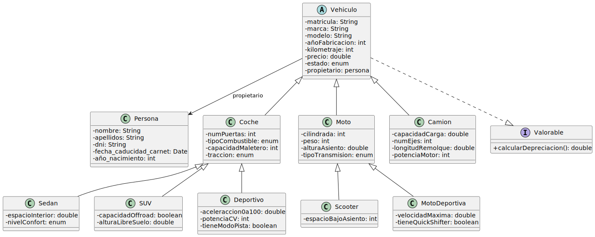

# Checklist de la tarea:
---
- [x] Crea un repositorio llamado UT5_ED_Prog.
- [x] Añade un README.md con una checklist de tareas.
- [x] Crea una carpeta uml/ con un fichero .puml.
- [x] Haz el primer commit con la estructura base súbelo al remoto (github).
- [x] Modela progresivamente atributos, métodos y relaciones entre clases.
- [x] Genera un diagrama UML en formato .svg con PlantUML:

# Documentación del proyecto
---
## Introducción
Este proyecto modela un sistema de gestión de vehículos mediante un diagrama de clases UML. El objetivo es representar diferentes tipos de vehículos, sus características específicas y la relación con su propietario. Además, se integra una interfaz para calcular la depreciación de cada vehículo en función de su tipo.

## Alcance y objetivos
### Alcance:
El modelo cubre los principales tipos de vehículos: coches, motos y camiones, incluyendo subtipos como sedán, SUV, scooter o moto deportiva. También se modela al propietario del vehículo mediante una clase Persona, y se incluye una interfaz Valorable para calcular la depreciación del valor del vehículo.

### Objetivos:
- Definir una jerarquía clara entre los distintos tipos de vehículos.
- Asociar cada vehículo con su propietario.
- Permitir que todos los vehículos puedan ser valorados económicamente.

## Diseño
Vehiculo es la clase (abstracta) base y las clases Coche, Moto y Camion heredan directamente de ella. Mientras que la clase Coche tiene subtipos como Sedan, SUV y Deportivo, la clase Moto tiene subtipos como Scooter y MotoDeportiva. Cada Vehiculo tiene un propietario del tipo Persona.

## Tecnologías utilizadas
- PlantUML para la generación del diagrama de clases en formato .puml y además convertirlo en .svg para su representación gráfica.
- GitHub para depositar los archivos de la tarea y crear el archivo de documentación.
